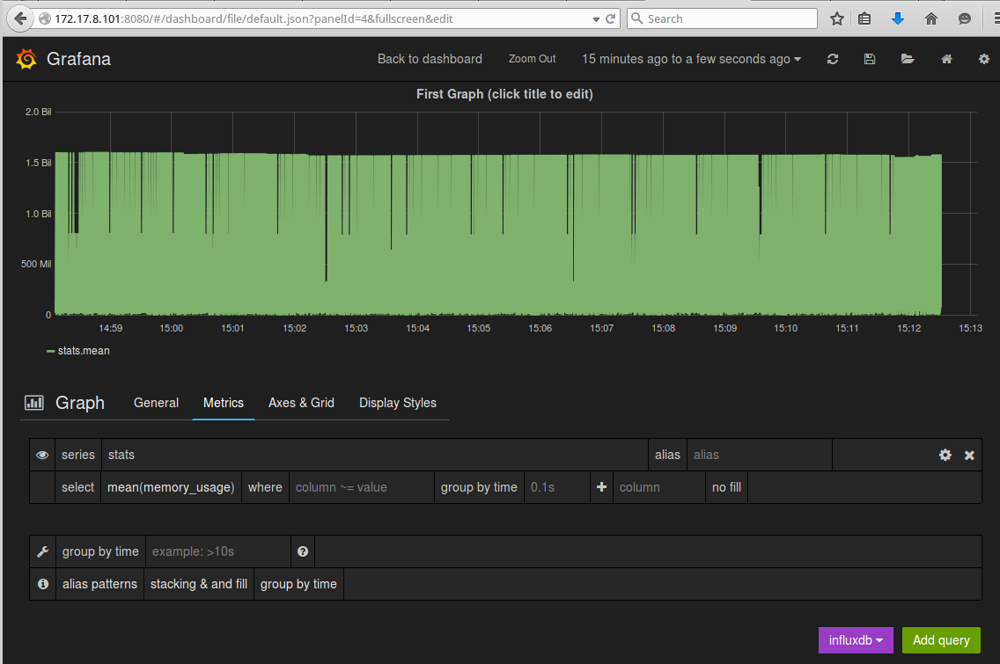

Factorish-InfluxDB
==================

About
-----

An example InfluxDB+Grafana application built using the [factorish]() toolkit.

This will spin up a CoreOS VM in vagrant and then proceed to build and deploy an influxdb container and a grafana container.   It will also run cadvisor which will automatically collect container metrics on the system and send them to influx db.

It uses etcd and confd to automatically configure both grafana and influxdb.

Using
-----


```
$ git https://github.com/factorish/factorish-influxdb.git
$ cd factorish-influxdb
$ vagrant up
rewriting userdata
Bringing machine 'core-01' up with 'virtualbox' provider...
==> core-01: Importing base box 'coreos-beta'...
==> core-01: Matching MAC address for NAT networking...
...
==> core-01: ++ echo Creating a Private Registry
==> core-01: Creating a Private Registry
...
$ vagrant ssh core-01
$ journalctl -f -u factorish-grafana
```

This will spin up the VM and watch for grafana to be built and started.   Once the logs indicate that grafana is running you can `CTRL-C` out of the logs and access grafana via `http://localhost:8080`.

]

Author(s)
======

Paul Czarkowski (paul@paulcz.net)

License
=======

Copyright 2014 Paul Czarkowski

Licensed under the Apache License, Version 2.0 (the "License");
you may not use this file except in compliance with the License.
You may obtain a copy of the License at

    http://www.apache.org/licenses/LICENSE-2.0

Unless required by applicable law or agreed to in writing, software
distributed under the License is distributed on an "AS IS" BASIS,
WITHOUT WARRANTIES OR CONDITIONS OF ANY KIND, either express or implied.
See the License for the specific language governing permissions and
limitations under the License.
